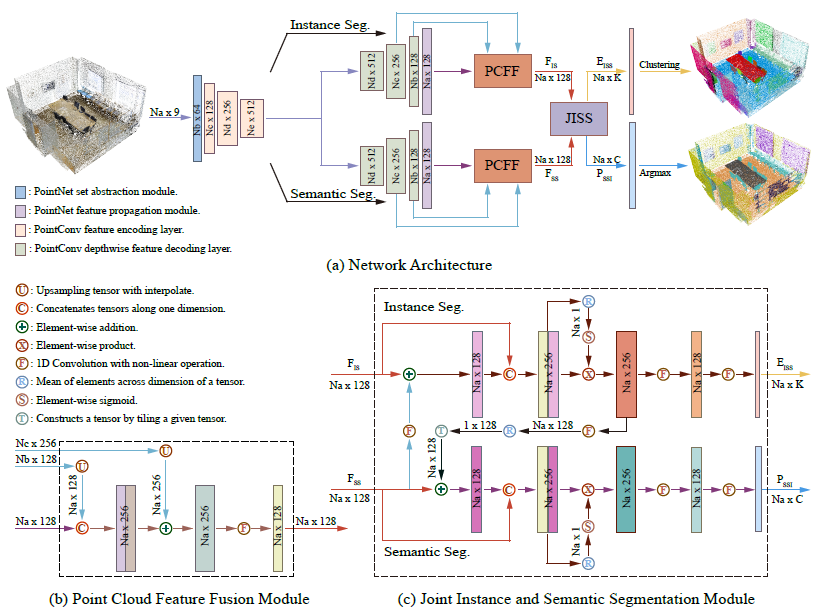

# JSNet: Joint Instance and Semantic Segmentation of 3D Point Clouds

<!-- [[arXiv]](https://arxiv.org) -->

## Overview


## Dependencies

The code has been tested with Python 3.5 on Ubuntu 16.04.
*  [TensorFlow](https://www.tensorflow.org/)
*  h5py


## Data and Model

* Download 3D indoor parsing dataset (S3DIS Dataset). Version 1.2 of the dataset is used in this work.

``` bash
python utils/s3dis_utils/collect_indoor3d_data.py
python utils/s3dis_utils/s3dis_gen_h5.py
cd data && python generate_input_list.py && python generate_train_test_list.py
cd ..
```

* (optional) Prepared HDF5 data for training is available [here](https://drive.google.com/open?id=1PjWweT61nmIX7zc2vJClhzHxyTHGvstQ).

* (optional) Trained model can be downloaded from [here](https://drive.google.com/open?id=1YioepsaYmpgqK3zqMtScoZEZBMjmSXMA).

## Usage

* Compile TF Operators

  Refer to [PointNet++](https://github.com/charlesq34/pointnet2)

* Training, Test, and Evaluation
``` bash
cd models/JISS/
ln -s ../../data .

# training
python train.py \
--gpu 0 \
--data_root ./ \
--data_type numpy \
--max_epoch  100  \
--log_dir ../../logs/train_5 \
--input_list data/train_file_list_woArea5.txt

# estimate_mean_ins_size 
python estimate_mean_ins_size.py \
--data_root ./ \
--input_list data/train_hdf5_file_list_woArea5.txt \
--out_dir ../../logs/train_5

# test
python test.py \
--gpu 0 \
--data_root ./ \
--data_type hdf5 \
--bandwidth 0.6   \
--num_point 4096  \
--log_dir ../../logs/test_5 \
--model_path ../../logs/train_5/epoch_99.ckpt \
--input_list  data/test_hdf5_file_list_Area5.txt

# evaluation
python eval_iou_accuracy.py --log_dir ../../logs/test_5
```

Note: We test on Area5 and train on the rest folds in default. 6 fold CV can be conducted in a similar way.

## Citation
If our work is useful for your research, please consider citing:

	@inproceedings{zhao2020jsnet,
		title={JSNet: Joint Instance and Semantic Segmentation of 3D Point Clouds},
		author={Zhao, Lin and Tao, Wenbing},
		booktitle={Thirty-Fourth AAAI Conference on Artificial Intelligence},
		year={2020}
	}


## Acknowledgemets
This code largely benefits from following repositories:
[ASIS](https://github.com/WXinlong/ASIS),
[PointNet++](https://github.com/charlesq34/pointnet2),
[PointConv](https://github.com/DylanWusee/pointconv),
[SGPN](https://github.com/laughtervv/SGPN) and
[DiscLoss-tf](https://github.com/hq-jiang/instance-segmentation-with-discriminative-loss-tensorflow)
